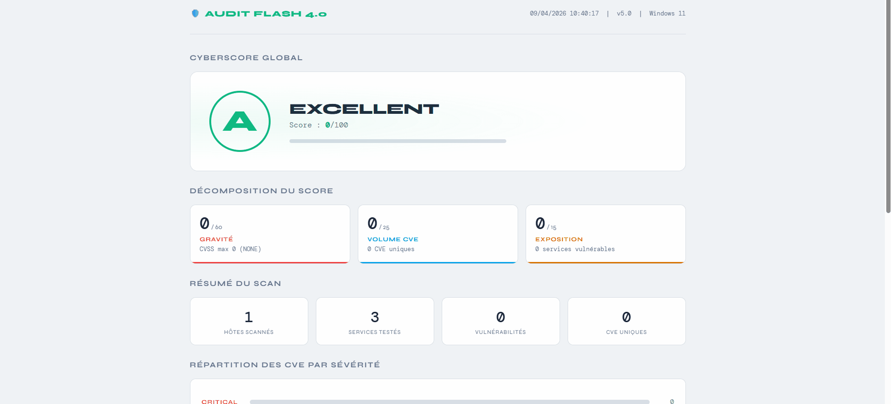
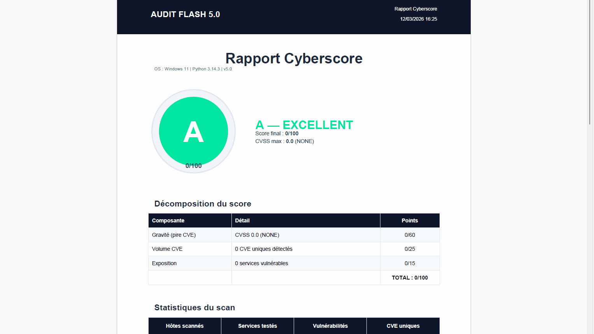

# Audit Flash --- 🏗️ Project In build, stay tuned ...

<p align="center">
  
  

<div align="center">

  


📌 This project allows you to perform a quick security audit of your work environment and generate a clear and accurate report of potential vulnerabilities. The goal is to see what data can be collected without an domain account and to highlight potential vulnerabilities.

</div>

</p>

---

## Table of contents
1. [Prerequisities](#-Prerequesities)
2. [What are we testing?](#-What-are-we-testing-)
3. [Cyberscore](#-cyberscore-report)
4. [Installation](#Installation)
5. [Usage](#Usage)
6. [Authors](#-authors---contributors)
7. [Links](#-Links)
8. [Demo](#-Demo)
9. [Disclaimers](#-legal-disclaimers)

## ✔️ Prerequesities
1. Just Plug and play the **NUC** on the company network 💻
2. **Operating System** Windows 10/11 🪟
3. Download **Python** from the official website [python.org](https://www.python.org/downloads/) and remember to tick the box: ✔️Add to PATH.
4. Download **Nmap** from [nmap.org](https://nmap.org/download.html)

## 🧪 What are we testing ?

### Port scanning & service detection
- [x] Open ports scanning (socket-based or Nmap) 🚪
- [x] Banner grabbing — automatic product & version detection on every open port 🏷️
- [x] CVE correlation in real time — NVD/NIST API v2.0 lookup by product/version, with local 24h cache 🔍
- [x] Local CVE fallback database — critical known CVEs (EternalBlue, BlueKeep, SMBGhost…) when API is unavailable 📦
- [x] Nmap NSE scripts (vuln, safe, smb-vuln, ssl, http-vuln, auth, discovery) 📜

### Default credentials testing
- [x] **FTP** — Anonymous login ❎
- [x] **SSH** — Default credentials (root/root, admin/admin, etc.) 🔑
- [x] **Telnet** — Default credentials (admin/admin, root/root, cisco/cisco, etc.) 🔑
- [x] **MySQL** — No password / default credentials (root, admin, test, etc.) 🔑
- [x] **Redis** — Access without authentication 🔑
- [x] **MongoDB** — Access without authentication 🔑

### Protocol-level testing
- [x] **HTTP/HTTPS** — Missing security headers (X-Frame-Options, CSP, HSTS, X-Content-Type-Options…) 🌐
- [x] **SMB** — Null session, guest access, SMBv1 detection 🗂️
- [x] **DNS** — Zone transfer test (AXFR) 📡
- [x] **LDAP** — Anonymous bind 📂
- [x] **RDP** — Exposure detection + NLA (Network Level Authentication) check 🖥️

### Network discovery
- [x] VLAN discovery via CDP/LLDP (root/admin mode) 🕸️
- [x] CIDR range scanning 🌐

## 🛡️ CYBERSCORE REPORT

The Cyberscore (0–100) is computed **exclusively from real CVEs/CVSS scores** found during the audit.

### Score calculation

| Component | Points | Description |
| :--- | :--- | :--- |
| **Base — Severity** | 0–60 pts | Based on the worst CVE severity: CRITICAL → 60, HIGH → 40, MEDIUM → 20, LOW → 8. Bonus +5 if 3+ severity levels present |
| **Volume — CVE count** | 0–25 pts | 1 CVE → 5, 2-3 → 10, 4-6 → 15, 7-10 → 20, >10 → 25 |
| **Exposure — Attack surface** | 0–15 pts | +5 pts per additional vulnerable service (max 15) |

> **Final Score** = min(100, Base + Volume + Exposure)

### Rating scale

| Grade | Score | Label | Description |
| :--- | :--- | :--- | :--- |
| 🟢 **A** | 0–19 | EXCELLENT | No critical CVE, minimal risk |
| 🔵 **B** | 20–39 | GOOD | A few low/medium severity CVEs |
| 🟡 **C** | 40–59 | MEDIUM | Moderate CVEs or accumulation of low ones |
| 🟠 **D** | 60–79 | BAD | High CVEs or multiple moderate CVEs |
| 🔴 **E** | 80–100 | CRITICAL | Critical CVEs or severe accumulation |

### Example report

| Metric | Value |
| :--- | :--- |
| **Final score** | 85/100 |
| **Grade** | 🔴 **E — CRITICAL** |
| **Base (severity)** | 60/60 pts |
| **Volume (CVE count)** | 15/25 pts |
| **Exposure (services)** | 10/15 pts |
| **Worst CVE** | CVSS 9.8 (CRITICAL) |
| **Total unique CVEs** | 7 |

## Installation

1. Clone the repository :
```
git clone https://github.com/Greta-Ardeche-Drome/Audit-Flash
```
2. Requirements installation :
```
# Python version
python --version

# Pip version
pip --version

# To install pip via python
python -m ensurepip --upgrade

# In the main folder where the file is
pip install -r requirements.txt
```
## Usage

1. Launch the script :
```
cd scripts/

# To see the options
python audit_flash.py -h
```

### General options

| Option | Description |
| :--- | :--- |
| `-t`, `--targets` | IP addresses, domains, or CIDR ranges (required) |
| `--profile PROFILE` | Predefined scan profile (see below) |
| `--list-profiles` | Display all available profiles and exit |
| `-p`, `--ports` | Ports to scan (ignored if `--profile` is used) |
| `-o`, `--output` | Output JSON file (default: `audit_report_cve.json`) |
| `--timeout` | Timeout in seconds (default depends on profile) |
| `--threads` | Number of threads (default depends on profile) |
| `--no-nmap` | Disable Nmap, use basic socket scan |
| `--domain DOMAIN` | Domain name for DNS zone transfer test |

### NSE Scripts (Nmap Scripting Engine)

| Option | Description |
| :--- | :--- |
| `--script-scan` | Global vuln scan: runs `--script vuln` on all discovered ports |
| `--nse CATEGORY [...]` | Additional NSE script categories (see below) |
| `--list-nse` | List available NSE categories |
| `--no-banner` | Disable banner grabbing (enabled by default) |

**Available NSE categories:**

| Category | Description | Intrusive? |
| :--- | :--- | :--- |
| `vuln` | Known vulnerability detection (SMB, SSL, HTTP…) | ⚠️ Yes |
| `safe` | Non-intrusive, safe scripts | ✅ No |
| `default` | Nmap default scripts | ✅ No |
| `discovery` | Information discovery (DNS, SNMP, SMB…) | ✅ No |
| `smb-vuln` | SMB vulnerabilities (EternalBlue, SMBGhost, SambaCry…) | ⚠️ Yes |
| `ssl` | SSL/TLS audit (Heartbleed, POODLE, weak ciphers) | ✅ No |
| `http-vuln` | Web vulnerabilities (Shellshock, path traversal…) | ⚠️ Yes |
| `auth` | Weak authentication tests | ⚠️ Yes |

### CVE Database (NVD/NIST)

| Option | Description |
| :--- | :--- |
| `--no-cve-api` | Disable NVD API (use local fallback database only) |
| `--cve-cache FILE` | CVE cache file (default: `cve_cache.json`) |
| `--clear-cve-cache` | Clear CVE cache before scanning |

> 💡 **NVD API Key**: Set `NVD_API_KEY` environment variable or create a `.nvd-api-key` file in the script directory. Get a free key at https://nvd.nist.gov/developers/request-an-api-key — 10x faster requests!

### Export options

| Option | Description |
| :--- | :--- |
| `--pdf FILE.pdf` | Generate a PDF report (requires `reportlab`) |
| `--html FILE.html` | Generate a standalone HTML report |

### VLAN Discovery

| Option | Description |
| :--- | :--- |
| `--discover-vlans` | Enable VLAN discovery via CDP/LLDP (root/admin required) |
| `-i`, `--interface` | Network interface for VLAN discovery (e.g. eth0, Ethernet) |
| `--vlan-timeout` | VLAN discovery timeout in seconds (default: 30) |

### Scan profiles

| Profile | Ports | Timeout | Description |
| :--- | :--- | :--- | :--- |
| 🔟 `top-10` | 10 | 2s | Top 10 most common Nmap ports |
| 🔝 `top-20` | 20 | 2s | Top 20 most common Nmap ports |
| 💯 `top-100` | 100 | 3s | Top 100 most common Nmap ports |
| 🪟 `windows` | 12 | 3s | Windows / Active Directory ports (SMB, LDAP, Kerberos, RDP, WinRM, MSSQL) |
| 🐧 `linux` | 15 | 3s | Common Linux server ports (SSH, FTP, HTTP, MySQL, PostgreSQL, Redis, MongoDB…) |
| 🌐 `web` | 11 | 2s | Web servers & applications (80, 443, 8080, 3000, 5000…) |
| 🔴 `full` | 1024 | 3s | Full scan ports 1–1024 (⚠️ Slow) |

### Examples

```bash
# Full scan with NSE vuln scripts on all discovered ports
python audit_flash.py -t 192.168.1.100 --profile top-100 --script-scan

# Specific NSE categories (SSL audit + SMB vulns)
python audit_flash.py -t 192.168.1.100 --nse smb-vuln ssl

# Scan a whole network with windows profile
python audit_flash.py -t 192.168.1.0/24 --profile windows

# Offline mode — local CPE database only, no Nmap
python audit_flash.py -t 192.168.1.100 --no-cve-api --no-nmap

# With VLAN discovery (requires root/admin)
python audit_flash.py -t 192.168.1.100 --profile windows --discover-vlans

# Generate PDF and HTML reports
python audit_flash.py -t 192.168.1.100 --script-scan --profile top-100 --pdf report.pdf --html report.html
```

2. Open your result :
- Double click on `report.html` or `report.pdf`
- See your Cyberscore in your browser or you PDF viewer 🟢🟠🔴

## 🤝 Authors - Contributors
3 students in Third year of bachelor's degree in cyber studies 👨‍🎓
- **Bertrand VEY** _alias_ [@Veybert](https://github.com/Veybert)
- **Titouan TUPINIER** _alias_ [@Raisin](https://github.com/Raisin-ArchiSec)
- **Eliot GLEYSE** _alias_ [@Eglzz](https://github.com/Eglzz)

🪜Any external contributions to the project that help improve and optimize its use are welcome. Feel free to :
- Add tests for other services
- Improve vulnerabilty detection
- Optimize  performance
- fix bugs

  
*The Project is created for educational and cybersecurity learning purposes.*
## 🔗 Links

## 📹 Demo
Here is a potential rendering with the HTML format :



And the PDF format : 


## ⚠️ Legal disclaimers

 This tool is intended for educational and legitimate security testing purposes only.

Use this tool **ONLY** on networks that you own or for which you have explicit written permission.
Unauthorized use of this tool may be illegal in your jurisdiction.
The authors are not responsible for any misuse of this tool.
